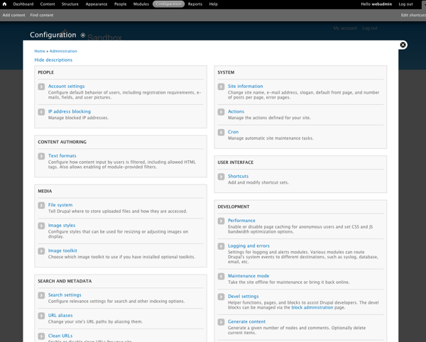

# Drupal
Drupal er en åpen kildekode-plattform og publiseringsløsning (CMS) for bygging av dynamiske nettsteder, nettbutikker og nettapplikasjoner.

Drupal tilbyr et bredt spekter av funksjoner og tjenester, blant annet brukeradministrering, publiseringsarbeidsflyt, nyhetsaggregering, kategorisering og mye mer.

Drupals fleksible arkitektur gjør løsningen enkel og kjapp å bruke for redaktører og skribenter.

I de senere år, har det blitt laget en rekke distribusjoner av Drupal, det vil si ferdig konfigurerte installasjoner tilrettelagt for spesifikke oppgaver: Drupal for aviser, Drupal for nyhetsaggregering, Drupal intranett, Drupal sosiale nettverk, Drupal webshop, med flere. Alle disse er bygd av de samme klossene, og dermed 100% kompatible med hverandre. 

Drupal er like mye et rammeverk som et CMS, noe som gir meget stor fleksibilitet. Noen har sagt at Drupal kan bruke til å "bygge sitt eget CMS". Utstyrt med en kraftig blanding av funksjoner og konfigurerbarhet kan Drupal støtte et bredt spekter av nettprosjekt fra personlige blogger til store nettsteder med tusenvis av brukere.

Drupal har en kjerne (Drupal Core) som gir deg basisfunksjonalitet med innholdstyper, kategorier, menyer, innebyggede sikkerhetsmekanismer, blokker og mye mer. I tillegg finnes en mengde moduler som kan utvide funksjonaliteten på siden.

Drupal ble startet i 2001 av hollenderen Dries Buytaert som fremdeles er en ledende skikkelse innen drupalmiljøet. Drupal er for tiden i versjon 7, med versjon 8 som vil komme rundt august 2013

## Hvorfor velge Drupal CMS?
Vi pleier i å illustrere Drupals fleksibilitet ved å si at endel CMS-er er som Playmo; de har et glatt og fint ytre, men det er begrenset hvor mye man kan bygge ut av figurene. Drupal derimot, er som Lego; med disse klossene kan man bygge nærmest hva som helst. Et annet bilde er dette: Skal du lage en blogg bruker du Wordpress. Skal du lage Wordpress bruker du Drupal! 

**Enkelt.** Drupals fleksible arkitektur gjør løsningen enkel og kjapp å bruke for redaktører og skribenter. Ved å konfigurere oppsett som passer til kundens arbeidsflyt, kan vi strippe bort alle forvirrende elementer. Slik skaper vi en løsningen som er kraftig, fleksibel og brukervennlig.

**Skreddersøm.** Med Drupal kan man opprette innholdstyper med akkurat de feltene og den workflowen man ønsker. Dette legger til rette for brukervennlige løsninger.

**Aktive brukere.** Drupal er perfekt for sider med brukergenerert innhold. Kommentarløsning, forum og avansert tilgangskontroll ligger i kjernen.

**Kostnadseffektivt.** Lisensen er gratis, og all tilleggsfunksjonalitet (moduler) ligger tilgjengelig på på drupal.org. Det finnes tusenvis av utvidelser klare til bruk.

**Fleksibel arkitektur.** Drupal er som lego, hvor man kan bygge på med ny funksjonalitet som kommuniserer med kjernen, og/eller andre moduler på høyeste nivå. Mange av de store modulene har dessuten en en veldig abstrakt arkitektur, slik at bruksområdene er utallige. Systemet har en tydelig og godt utviklet API, som gjør at avansert funksjonalitet kan oppnåes med minimale mengder kode. Med Drupal møter man aldri veggen; "alt" er mulig.

**Sikkerhet.** Drupal har et eget sikkerhetsteam som sjekker både kjernen og tredjepartsmoduler. Kompetansen i det sentrale utviklermiljøet er svært høy.

## Drupal for aviser
Mange aviser i Skandinavia kjører på Drupal. [Les mer Drupal og løsninger for Nettavis](http://www.newsfront.no)