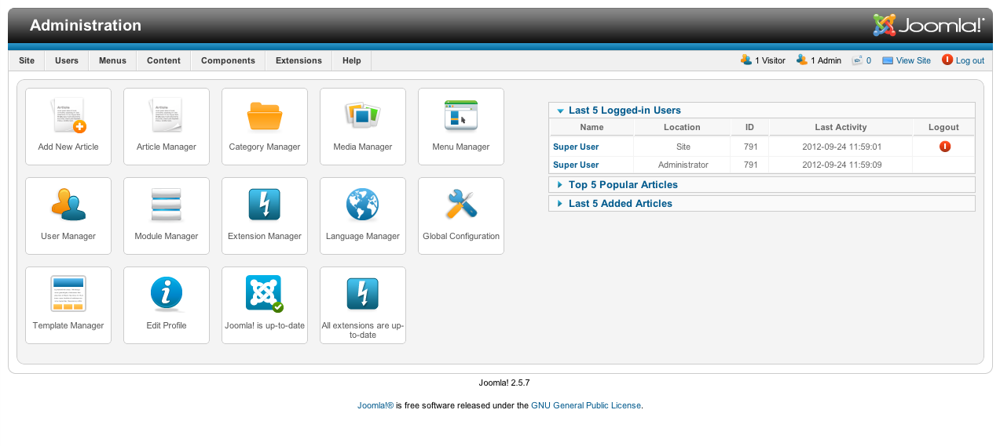

# Joomla
Joomla er en åpen publiseringsløsning (CMS) for nettsider, nettbutikker og nettapplikasjoner. Joomla har røtter tilbake til 2000, ble et selvstendig prosjekt i 2005 og har helt siden det vært en solid maktfaktor blant floraen av open source CMS. 

Joomla er skrevet i programmeringsspråket PHP og trenger en MySQL database for å fungere. Ut av boksen får du en stor verktøyboks for å håndtere brukere, innhold, menyer, utseende og mye mer.

Joomla kan utvides ved å bruke Joomla extensions som det finnes ca 10.000 av på den offisielle siden for [Joomla extensions](http://extensions.joomla.org/). Man kan bruke Joomla templates som maler for nettsiden siden sin og det finnes mange slike maler tilgjengelig både gratis og kommersielle.

