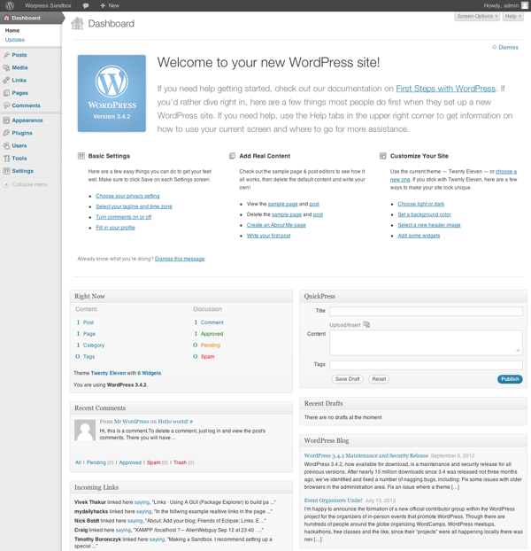

# Wordpress
Med ufattelige 75 millioner sider som er bygget på Wordpress og 25% av alle nettsteder i verden, er det ingen tvil om at Wordpress virkelig har bragt Open Source CMS til de brede massene.

Hvis du vil ha en egen custom blogg oppe å stå på rekordtid er det vanskelig å slå Wordpress, og den berømte 5 minutters installasjonsprosessen har lenge vært et viktig salgsargument for Wordpress.

Halvparten av alle Wordpress-sider er hosted på wordpress.com som er en kommersiell hostingleverandør, men selve Wordpress koden er 100% gratis og gir deg full kontroll over alle aspekter ved siden.

En styrke ved Wordpress er det oversiktlige og standardiserte kontrollpanelet som gjør de enkleste oppgavene svært enkle å utføre for både deg og bestemor. Denne enkelheten var gull verd for en del år tilbake da blogging var nytt og ble en viktig faktor for å velge Worpress fremfor andre CMS:

Siden Wordpress er størst betaler de en pris da de blir et hovedmål for hacking og svindelforsøk. Det er derfor viktig å holde en Wordpress side oppdatert, da det med jevne mellomrom kommer sikkerhetsoppdateringer for å svare på sikkerhetstrusler.

